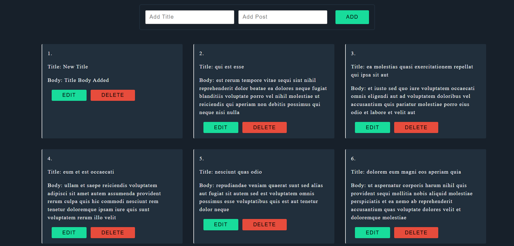

# 📌 React CRUD Post App

A React-based CRUD Post Management Application using **Axios** and **REST API** to Create, Read, Update, and Delete posts dynamically without page reload.

Live Project 🚀  
🔗 https://anoop-react-crud-post-app.netlify.app/

---

## 🖼️ Project Screenshot

![Project Screenshot]


> Note: This screenshot shows the UI of the deployed CRUD App.

---

## ✨ Features

✔ Add New Posts  
✔ Display Posts Dynamically  
✔ Edit and Update Posts  
✔ Delete Posts with One Click  
✔ API Integration using Axios  
✔ Fully Responsive UI  
✔ Real-time State Updates  
✔ Clean and Modular Code Structure  

---

## 🛠️ Tech Stack

| Technology | Usage |
|-----------|-------|
| React.js | Frontend UI |
| Axios | API Requests |
| REST API | CRUD Backend (JSONPlaceholder) |
| CSS | Styling |
| Netlify | Deployment |

---

## 📦 Installation & Run Locally

```bash
# Clone this repository
git clone https://github.com/AnoopShukla-ProjectWorld/react-crud-post-app.git

# Navigate to project folder
cd react-crud-post-app

# Install dependencies
npm install

# Run the project
npm run dev
